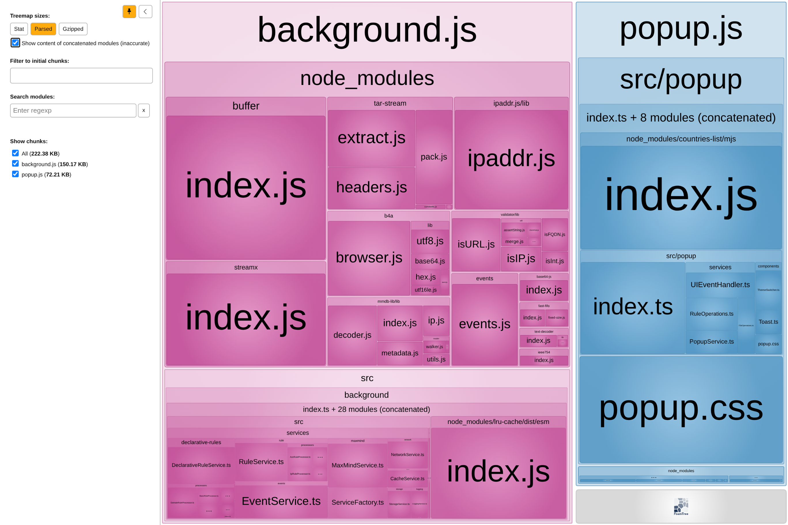

# Simple Firewall For Your Browser

<div align="center">
  
</div>

[](https://addons.mozilla.org/firefox/addon/veto-firewall/)
[](https://github.com/veto-firewall/veto/actions/workflows/ci.yml)
[](https://github.com/veto-firewall/veto/actions/workflows/release.yml)
[](https://patreon.com/veto_firewall)

Firefox extension that provides advanced filtering capabilities with GeoIP, ASN, domain, URL, and content blocking. It serves as a simple firewall for privacy and security. Available on [Firefox Add-ons Store](https://addons.mozilla.org/firefox/addon/veto-firewall/).

> [!IMPORTANT]
> A MaxMind License key is required to enable GeoIP and ASN blocking features. Create a <a href="https://www.maxmind.com/en/geolite2/signup" target="_blank" rel="noopener noreferrer"><strong>free account</strong></a>, then generate your<a href="https://www.maxmind.com/en/accounts/current/license-key" target="_blank" rel="noopener noreferrer"><strong> license key here</strong></a>.

- [Features](#features)
- [Installation](#installation)
  - [Method 1: Install from Mozilla Add-ons (Recommended)](#method-1-install-from-mozilla-add-ons-recommended)
  - [Method 2: Install from GitHub (.xpi file)](#method-2-install-from-github-xpi-file)
    - [For Desktop (Firefox)](#for-desktop-firefox)
    - [For Android (Firefox)](#for-android-firefox)
- [Architecture and Dependencies](#architecture-and-dependencies)
  - [Technology Stack](#technology-stack)
  - [Dependencies](#dependencies)
  - [Bundle Analysis](#bundle-analysis)
- [Building and Publishing](#building-and-publishing)
  - [Prerequisites](#prerequisites)
  - [Building from Source](#building-from-source)
  - [Publishing a New Release](#publishing-a-new-release)
- [Contributing](#contributing)

## Features

VETO gives you fine-grained control over your browsing experience by allowing you to:

- **GeoIP Filtering**: Block or allow web requests based on the geographic location of the server
- **ASN Blocking**: Filter traffic from specific Autonomous System Numbers (network providers)
- **Domain & URL Filtering**: Create rules to block or allow specific domains and URLs
- **Content Blocking**: Filter out unwanted content from websites
- **Simple Interface**: Easy-to-use popup interface to manage all filtering rules

To use GeoIP and ASN filtering features you need a free MaxMind account:

1. Sign up [here](https://www.maxmind.com/en/geolite2/signup)
2. Generate a [license key](https://www.maxmind.com/en/accounts/current/license-key)
3. Enter this key in VETO settings
4. Click "Save" to save your license key

## Installation

## Method 1: Install from Mozilla Add-ons (Recommended)
> [!IMPORTANT]
> Note that the Firefox Extensions Store version is currently under review, with an estimated wait time of up to a month.

<!--
1. Open **Firefox** on your desktop or Android device;
2. Visit the [VETO Add-on page on AMO](https://addons.mozilla.org/en-US/firefox/addon/veto-firewall/);
3. Click **Add to Firefox**;
4. When prompted, click **Add** to confirm the installation;
5. Follow any on-screen instructions to complete setup.
-->

## Method 2: Install from GitHub (.xpi file)

Download the latest signed `.xpi` extension file from our [GitHub releases page](https://github.com/veto-firewall/veto/releases), then follow the appropriate instructions for your device:

### For Desktop (Firefox)

1. Open **Firefox**;
2. Go to `about:addons` by entering it in the address bar, or navigate to **Settings** > **Extensions & Themes** > **Extensions**;
3. Click the gear icon (⚙️) at the top right;
4. Select **Install Add-on From File...**;
5. Locate and select the `.xpi` file you downloaded earlier;
6. Follow the on-screen prompts to complete the installation.

### For Android (Firefox)

1. Open **Firefox** on your Android device;
2. Tap the three-dot menu and go to **Settings**;
3. Scroll down and select **About Firefox**;
4. Rapidly tap the Firefox logo five times to enable the Debug menu;
5. Without closing Firefox, return to **Settings**;
6. Tap **Install extension from file** (now visible in the menu);
7. Locate and select the `.xpi` file you downloaded earlier;
8. Follow the on-screen prompts to complete the installation.

## Architecture And Dependencies

The extension follows a service-based architecture:

- **Service Layer**: Core functionality organized into services:
  - **StorageService**: Manages all browser storage operations
  - **RuleService**: Handles rule management and processing
  - **NetworkService**: Manages DNS resolution and network operations
  - **MaxMindService**: Handles GeoIP and ASN database operations
  - **EventService**: Coordinates browser events and message handling
- **Background Script**: Initializes services and connects components
- **Popup Interface**: User interface for managing rules and settings
- **Utility Modules**: Handle specialized functions and provide helpers

### Technology Stack

- **TypeScript**: Core language for development
- **Webpack**: Module bundling
- **ESLint**: Code quality and style enforcement
- **Mozilla Web Extensions API**: For browser integration

### Dependencies

The extension uses several key technologies:

- **Mozilla's WebExtension API**: For browser integration
- **declarativeNetRequest API**: For efficient network request filtering
- **Storage API**: For storing user preferences and rules
- **DNS API**: For domain name resolution

### Bundle Analysis

[](https://veto-firewall.github.io/veto/bundle-report.html)

## Building and Publishing

### Prerequisites

- Node.js (v14+)
- npm or yarn

### Building from Source

1. Clone the repository:
   ```bash
   git clone https://github.com/veto-firewall/veto.git
   cd veto
   ```

2. Install dependencies:
   ```bash
   npm install
   ```

3. Build the extension:
   ```bash
   npm run package
   ```

4. The built extension will be available in the `dist` directory

### Publishing a New Release

The release process is fully automated through GitHub Actions:

1. Go to the [Actions tab](https://github.com/veto-firewall/veto/actions) in the GitHub repository
2. Select the "Release" workflow
3. Click on "Run workflow" and provide the following inputs:
   - **Version type**: Choose between `patch`, `minor`, or `major` to determine how the version number should be incremented
   - **Distribution channel**: Select `listed` for public distribution or `unlisted` for private distribution

The workflow (`.github/workflows/release.yml`) will automatically:
   - Update the version in `package.json` and `src/manifest.json`
   - Build the extension
   - Sign the extension with Mozilla's Web-Ext API
   - Create a GitHub release with:
     - Source code archive
     - Unsigned extension package (zip)
     - Signed extension package (xpi)
     - Checksums for all files
   - Submit the extension to Firefox Add-ons with the specified distribution channel

No manual steps are required as the entire process from version bumping to Firefox submission is handled by the workflow.

## Contributing

Contributions are welcome! Please feel free to submit a Pull Request.

---

Enjoy!
