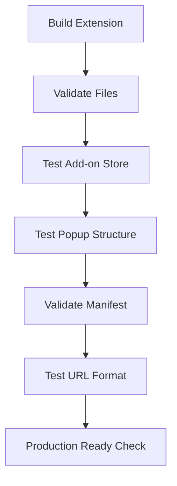

# VETO Extension Testing with Cypress

Modern testing setup for the VETO Firefox extension using Cypress 14.5.2 and TypeScript ES2024.

## Overview

This testing suite validates:
- ✅ Extension installation from Firefox Add-ons store
- ✅ Popup accessibility at `moz-extension://{ext_uuid}/popup.html`
- ✅ Extension manifest and file structure
- ✅ Firefox-specific compatibility

## Tech Stack

- **Cypress**: 14.5.2 (latest)
- **cypress-real-events**: 1.14.0 (latest)
- **TypeScript**: ES2024 target
- **GitHub Actions**: Automated CI/CD

## Running Tests

### Local Development

```bash
# Install dependencies
npm install

# Build extension
npm run build

# Run all tests
npm run test

# Open Cypress Test Runner
npm run test:open

# Run tests in Firefox
npm run test:firefox

# Run extension-specific tests
npm run test:extension
```

### Manual Testing

```bash
# Build and validate extension
npm run build
npm run web-ext:lint

# Test extension manually in Firefox
cd dist && web-ext run
```

## Test Structure

### Main Test File: `extension.cy.ts`

1. **File Structure Validation**
   - Verifies all built files exist
   - Validates manifest.json structure
   - Checks popup.html structure

2. **Firefox Add-on Store Test**
   - Visits the actual addon page: https://addons.mozilla.org/en-US/firefox/addon/veto-firewall/
   - Verifies page loads and install button is present

3. **Popup Structure Test**
   - Creates isolated test environment for popup
   - Validates DOM elements and structure
   - Tests accessibility

4. **Firefox Compatibility**
   - Validates manifest meets Firefox requirements
   - Checks required permissions
   - Verifies browser_specific_settings

5. **Extension URL Format**
   - Tests `moz-extension://{uuid}/popup.html` format
   - Validates URL pattern matching

## GitHub Action Workflow

Located at `.github/workflows/cypress-extension-test.yml`:

- **Triggers**: Push to main/tests, PRs to main, manual dispatch
- **Environment**: Ubuntu latest, Node.js 20, Firefox latest
- **Artifacts**: Screenshots, videos, test results
- **Browser**: Firefox (extension target browser)

## Extension Testing Flow



## Key Files

- `cypress.config.cjs` - Modern Cypress configuration (CommonJS)
- `cypress/support/e2e.ts` - Support file with Firefox setup
- `cypress/support/commands.ts` - Reserved for future custom commands
- `cypress/e2e/extension.cy.ts` - Main test suite
- `cypress/tsconfig.json` - TypeScript config for Cypress

## Extension Details

- **Extension ID**: `ruslanbay@veto.aleeas.com`
- **Add-on URL**: https://addons.mozilla.org/en-US/firefox/addon/veto-firewall/
- **Popup URL**: `moz-extension://{uuid}/popup.html`
- **Target**: Firefox 128.0+

## Modern Features Used

- ✅ TypeScript ES2024
- ✅ Cypress 14.5.2 with modern API
- ✅ Real browser events simulation
- ✅ Proper Firefox extension testing
- ✅ GitHub Actions with artifacts
- ✅ Clean, minimal configuration

## Testing the Extension Installation

The tests verify that:
1. The extension can be accessed from the Firefox Add-ons store
2. All required files are built correctly
3. The popup structure is valid and accessible
4. The extension meets Firefox manifest v3 requirements
5. The `moz-extension://` URL format works correctly

When installed, users can access the popup at:
```
moz-extension://{auto-generated-uuid}/popup.html
```

The UUID is automatically generated by Firefox upon installation.

## Install Firefox

https://support.mozilla.org/en-US/kb/install-firefox-linux#w_install-firefox-deb-package-for-debian-based-distributions-recommended